# Java Quotes App - Docker & Multi-Stage Build Project

## Overview

This project demonstrates how to containerize a Java application using Docker. It covers the complete workflow from creating a Dockerfile, building images, running containers, optimizing image size using multi-stage builds, and managing the application with Docker Compose.

The objective of this project is to understand Docker fundamentals and Docker image optimization techniques used in real-world DevOps environments.

---

## Technologies Used

* Java
* Docker
* Docker Compose
* Linux (Ubuntu)
* Git & GitHub

---

## Project Structure

```text
java-quotes-app/
├── Dockerfile
├── Dockerfile.multi
├── docker-compose.yml
├── .dockerignore
├── src/
├── screenshots/
└── README.md
```

---

# Implementation Steps

## Step 1: Create Project Structure and Dockerfile

A Dockerfile was created to containerize the Java Quotes Application.

### Screenshot

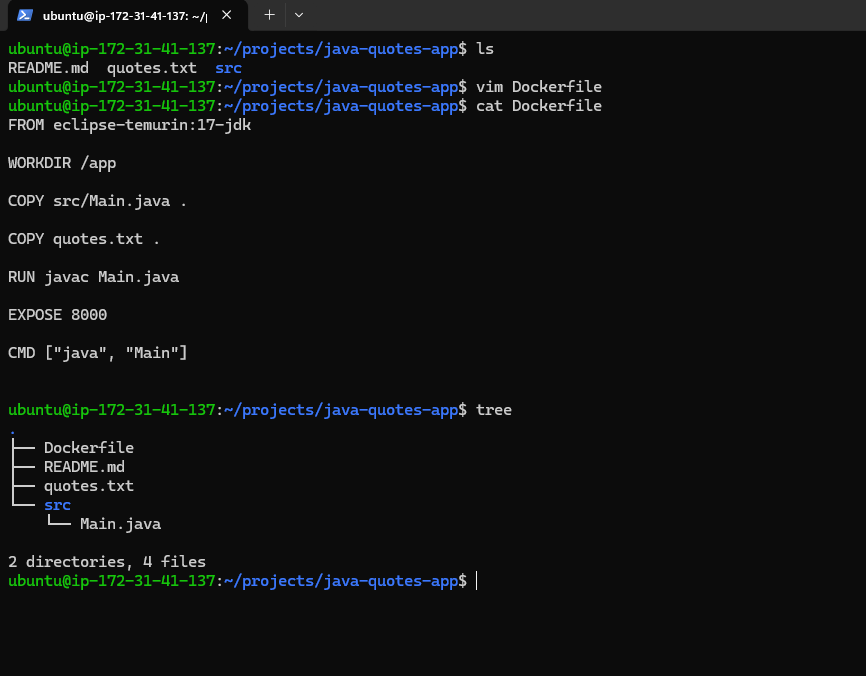

---

## Step 2: Build Docker Image

The Docker image was built using the Dockerfile.

### Screenshot

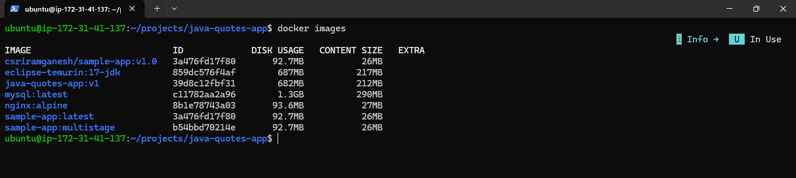

---

## Step 3: Run Container

A container was created and started from the generated image.

### Screenshot

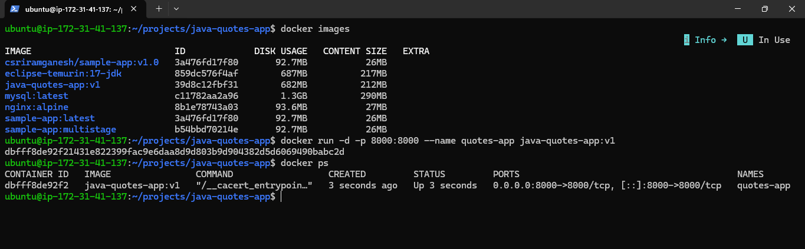

---

## Step 4: Verify Application

The application was accessed through a web browser to confirm successful deployment.

### Screenshot

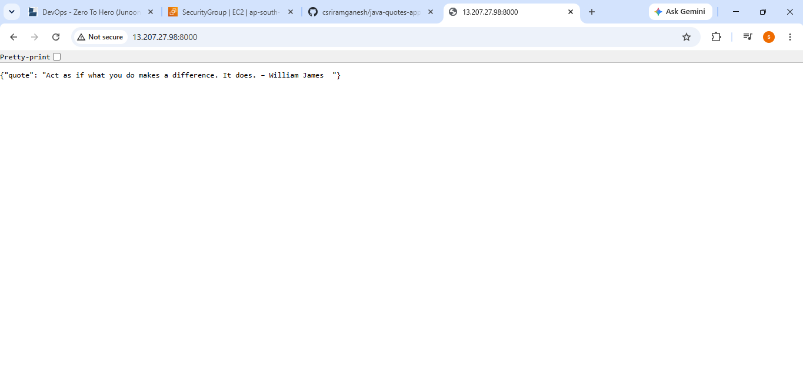

---

## Step 5: Check Container Logs

Docker logs were used to verify application startup and runtime behavior.

### Screenshot

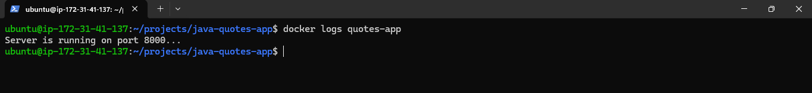

---

## Step 6: Create .dockerignore

A .dockerignore file was added to exclude unnecessary files from the Docker build context, resulting in cleaner and more efficient image builds.

### Screenshot

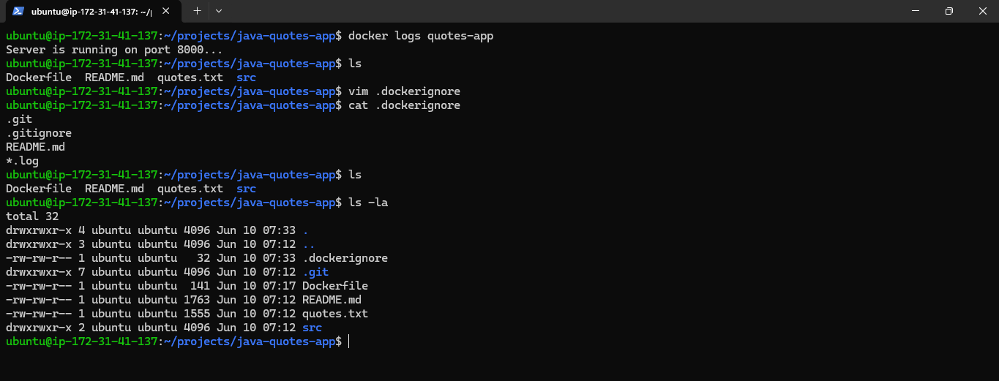

---

# Multi-Stage Docker Build

## Why Multi-Stage Builds?

Multi-stage builds help reduce image size by separating the build environment from the runtime environment.

### Benefits

* Smaller Docker images
* Faster deployments
* Reduced attack surface
* Better resource utilization

---

## Step 7: Create Multi-Stage Dockerfile

A multi-stage Dockerfile was created and a new optimized image was built.

### Screenshot

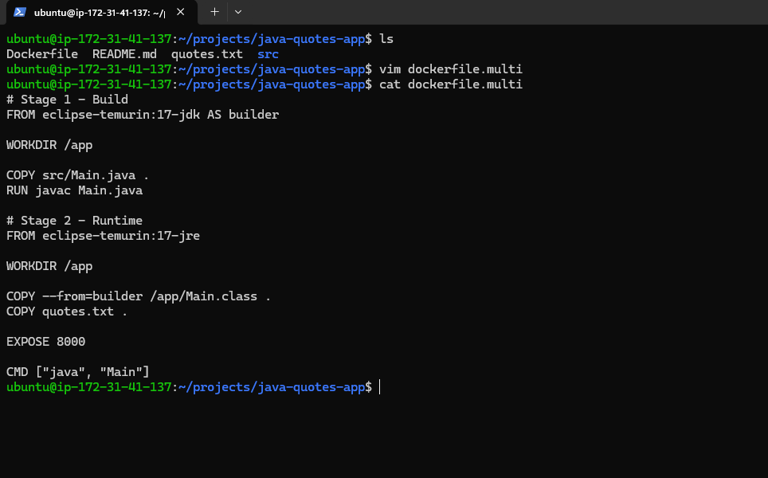

---

## Step 8: Compare Image Sizes

Image sizes were compared to evaluate the benefits of multi-stage builds.

### Screenshot

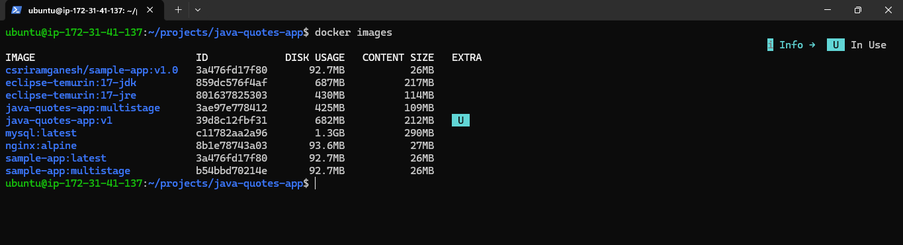

### Observation

The multi-stage image was significantly smaller than the traditional image because only the required runtime artifacts were included.

---

## Step 9: Run Multi-Stage Container

The optimized image was executed successfully.

### Screenshot

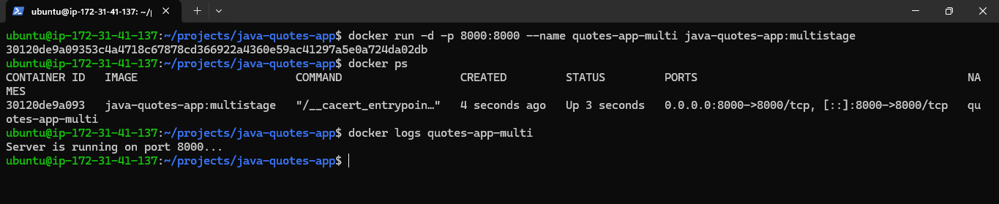

---

# Docker Compose

## Step 10: Create Docker Compose Configuration

A docker-compose.yml file was created to simplify application deployment.

### Screenshot

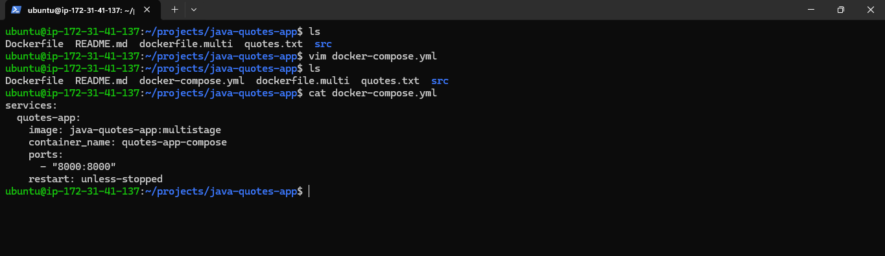

---

## Step 11: Deploy Using Docker Compose

The application was deployed using Docker Compose and container status was verified.

### Screenshot

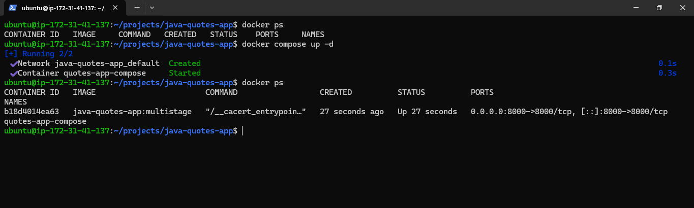

---

# Commands Used

## Build Image

```bash
docker build -t quotes-app .
```

## Run Container

```bash
docker run -d -p 8000:8000 --name quotes-app quotes-app
```

## View Logs

```bash
docker logs quotes-app
```

## Build Multi-Stage Image

```bash
docker build -f Dockerfile.multi -t quotes-app-multistage .
```

## Run Multi-Stage Container

```bash
docker run -d -p 8000:8000 --name quotes-app-multi quotes-app-multistage
```

## Docker Compose Deployment

```bash
docker compose up -d
```

## Verify Running Containers

```bash
docker compose ps
```

---

# Key Learnings

* Understanding Docker images and containers
* Writing Dockerfiles for Java applications
* Using .dockerignore effectively
* Building and running Docker containers
* Implementing multi-stage Docker builds
* Comparing image sizes and optimization techniques
* Managing applications using Docker Compose
* Container lifecycle management and troubleshooting

---

# Author

Sriram Ganesh

GitHub: https://github.com/csriramganesh

Part of my DevOps learning journey focused on Docker containerization and image optimization.


